## Лабораторная работа №4

**Цель:** Провести Брутфорс атаку на уязвимимые операционные системы

**Задача 1:** Установить Убунту на Виртуальную Машину -> Создать простого пользователя (admin) и установить ему пароль "123" -> С помощью Hydra, установленного в Кали Линуксе, провести манипуляции по подбору логинов и паролей на открытые порты.

**Задача 2:** Установить и развернуть на Виртуальной Машиине уязвимую машину Metasploitable -> Просканировать на Кали Линуксе открытые порты и уязвимости Metasploitable -> С помощью Hydra, установленного в Кали Линуксе, провести манипуляции по подбору логинов и паролей на открытые порты.

**Задача 3:** Написать политику паролей.

_______________________________________________

**Задача 1.**

Установка и запуск Убунту на Виртуальной Машине
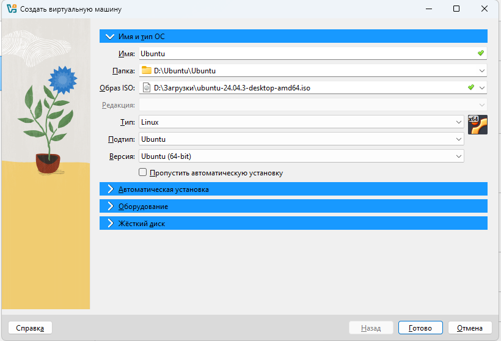

Создание простого пользователя
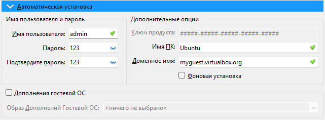

С помощью команды "ip a" на Убунту, смотрим айпи адрес системы
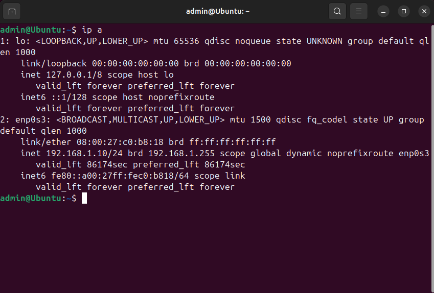
айпи адрес - 191.168.1.10

Сканируем айпи адрес в Кали
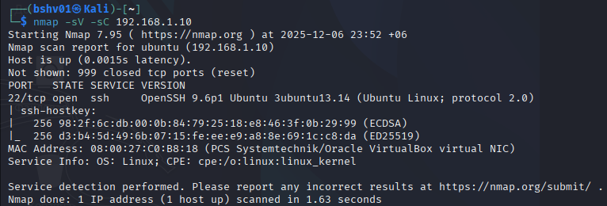
Видим один открытый порт 22

Проведение атаки
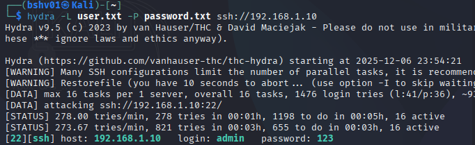
Командой hydra проводим подбор логинов и паролей из заранее созданных файлов с возможными, простыми логинами и паролями
_______________________________________________

**Задача 2.**

Установка и запуск Metasploitable
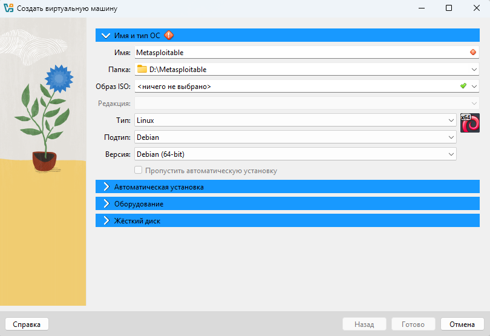
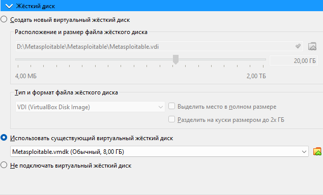

Вход в систему
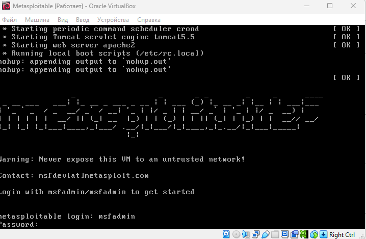
Логин и пароль стоят по умолчанию - msfadmin : msfadmin

Просмотр айпи адреса
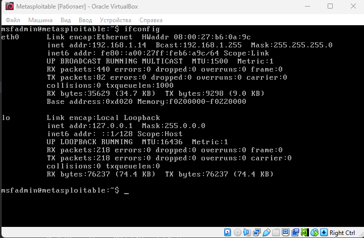
Айпи адрес машины - 192.168.1.14

Сканирование айпи адреса
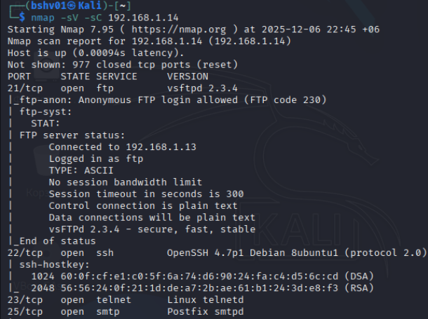
Командой nmap проводим сканирование открытых портов

Проведение атаки
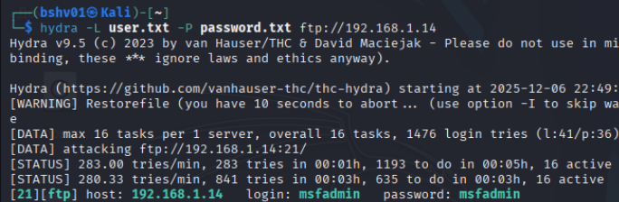
Командой hydra проводим подбор логинов и паролей из заранее созданных файлов с возможными, простыми логинами и паролями
_______________________________________________

**Политика паролей**

Требования к созданию паролей:

1. Минимальная длина пароля — не менее 10 символов.
2. Пароль должен включать в себя:  

    строчные буквы (a–z);  
    заглавные буквы (A–Z);  
    цифры;  
    при возможности — специальные символы (!, %, *, ?, # и др.).  
3. Запрещается использовать:  
   простые комбинации типа 123456, qwerty, password;

    информацию, которую легко узнать: дату рождения, имя, фамилию, номер телефона, название группы;

    один и тот же пароль на нескольких важных сервисах одновременно.

4. Рекомендуется использовать фразы-пароли
    например: «MoyKotikSpitNaKlave2025!».

**Использование паролей**

1. Пароль должен быть известен только студенту.
2. Передавать пароль друзьям, одногруппникам, преподавателям или посторонним лицам запрещается.
3. Если сервис позволяет, рекомендуется включать двухфакторную аутентификацию (2FA) — Google Authenticator, SMS-код, подтверждение на телефоне.
4. При входе на общедоступных компьютерах (компьютерные классы, библиотеки, интернет-кафе) необходимо:  
   
    не сохранять пароль в браузере;  
    выйти из всех аккаунтов после завершения работы.

**Хранение паролей**

1. Пароли нельзя хранить в открытом виде:  
    в блокноте телефона;

    в заметках на компьютере;

    на листке бумаги;

    в фотографиях.

2. Разрешено использовать безопасные приложения для хранения паролей: KeePass, Bitwarden, 1Password, Google Password Manager.
3. При использовании менеджера паролей основной (мастер-пароль) должен быть особенно сложным.

**Смена пароля**

1. Рекомендуемая периодичность смены паролей — один раз в 4–6 месяцев.
2. Пароль необходимо сменить немедленно, если студент заметил:  
    входы в учётные записи из неизвестных мест;

    уведомления о попытках взлома;

    подозрительные сообщения на почте или в социальных сетях.